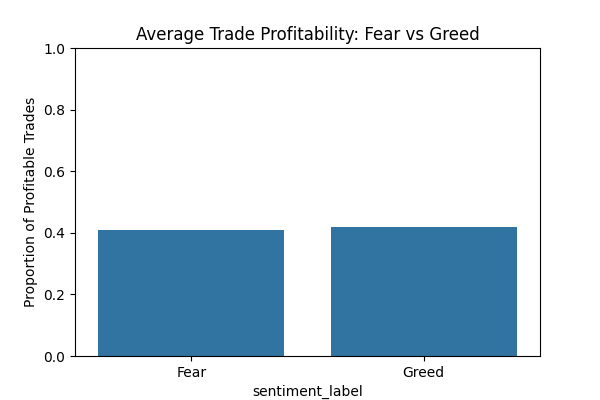
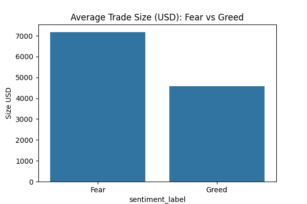
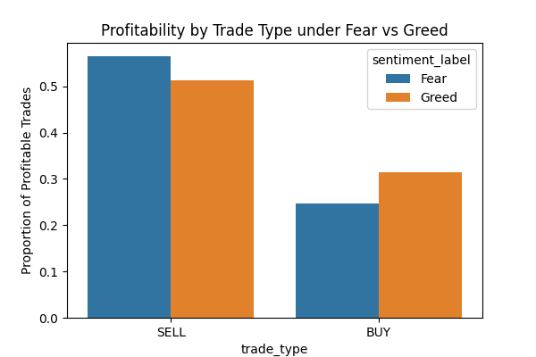

# Data Science Assignment — Web3 Trading

## 📌 Table of Contents
- [Project Overview](#-project-overview)  
- [Folder Structure](#-folder-structure)  
- [Google Colab Notebook](#-google-colab-notebook)  
- [How to Run the Notebook](#-how-to-run-the-notebook)  
- [Key Analysis Performed](#-key-analysis-performed)  
- [Key Insights](#-key-insights)  
- [Sample Visualizations](#-sample-visualizations)  
- [Technologies & Tools](#-technologies--tools-used)  
- [References](#-references)  
- [Summary](#-summary)  

---

## 🚀 Project Overview

This project explores the relationship between **trader behavior** and **Bitcoin market sentiment** using two datasets:

1. **Bitcoin Market Sentiment Dataset** — Fear & Greed Index  
2. **Historical Trader Data from Hyperliquid** — account-level trades  

**Objective:** Identify patterns in **profitability, trade size, and trade direction** under different market sentiment conditions (Fear vs Greed) and provide actionable insights for trading strategies.

---

## 🗂 Folder Structure

ds_ryuk/
├── notebook_1.ipynb # Google Colab notebook with step-by-step analysis
├── csv_files/ # Original and processed CSV datasets
│ ├── fear_greed.csv
│ ├── hyperliquid.csv
│ ├── merged_trades_sentiment.csv
│ ├── profit_summary.csv
│ ├── volume_summary.csv
│ └── buy_sell_summary.csv
├── outputs/ # Visual outputs (charts, graphs)
│ ├── profitability_fear_greed.png
│ ├── trade_size_fear_greed.png
│ └── buy_sell_profitability.png
├── ds_report.pdf # Final PDF report summarizing the analysis
└── README.md # Project documentation

---

## 📂 Google Colab Notebook
[**Open notebook_1.ipynb in Google Colab**](https://colab.research.google.com/github/codewithshruu/ds_shrutigupta/blob/main/notebook_1.ipynb)  

> Click the link to run the notebook directly and explore the analysis interactively.

---

## 📝 How to Run the Notebook

1. Open the notebook in **Google Colab**.  
2. Upload all CSV files under the left panel (Files).  
3. Execute cells step by step to reproduce the analysis.  
4. Processed datasets and visualizations will be saved in `csv_files/` and `outputs/`.

---

## 🔍 Key Analysis Performed

### 1️⃣ Data Cleaning & Processing
- Converted timestamps to proper datetime format and extracted `date_only`.  
- Merged trader data with the Fear & Greed Index.  
- Handled missing sentiment values using forward/backward fill.  
- Created additional numeric columns:
  - `side_numeric` → BUY = 1, SELL = -1  
  - `profit_flag` → 1 = profitable trade, 0 = loss  
  - `sentiment_numeric` → 0 = Fear, 1 = Greed  

### 2️⃣ Exploratory Data Analysis (EDA)
- BUY vs SELL trade counts  
- Profitable vs losing trades  
- Trade volume by sentiment (Fear vs Greed)  

### 3️⃣ Advanced Analysis
- Profitability under Fear vs Greed  
- Average trade size by sentiment  
- BUY vs SELL profitability under each sentiment  

---

## 📊 Key Insights

- **SELL trades are generally more profitable** than BUY trades under both Fear and Greed.  
- Traders execute **larger trade volumes during Fear**, indicating higher risk-taking.  
- Profitability is slightly higher during Greed, but the difference is minor.  
- Monitoring the Fear & Greed Index can help optimize trade sizes and reduce risk, particularly for BUY trades during Fear.

---

## 📈 Sample Visualizations

| Analysis | Plot |
|----------|------|
| Profitability by Sentiment |  |
| Trade Size by Sentiment |  |
| BUY vs SELL Profitability |  |

> *Click images to view full-size versions.*

---

## ⚡ Technologies & Tools Used
- **Python** — pandas, numpy  
- **Data Visualization** — matplotlib, seaborn  
- **Google Colab** — for interactive notebooks  
- **Git & GitHub** — version control and submission  

---

## 📂 References
- Historical Trader Data: `hyperliquid.csv`  
- Bitcoin Market Sentiment: `fear_greed.csv`  
- Analysis performed using Python in Google Colab  

---

## 🏆 Summary

This submission demonstrates the ability to:  
- Perform **data cleaning, feature engineering, and dataset merging**  
- Conduct **exploratory and advanced data analysis**  
- Extract **actionable insights** and visualize results professionally  
- Follow **company submission guidelines strictly** with a reproducible structure  

> This README, along with all CSVs, plots, notebooks, and report, ensures a **complete, professional, and evaluation-ready submission**.

